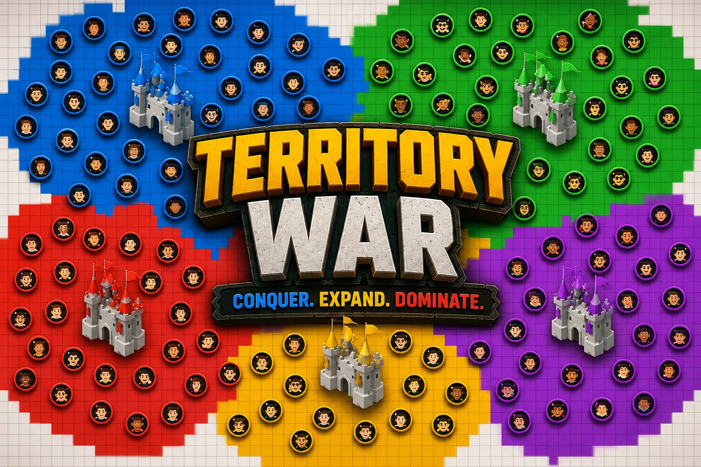
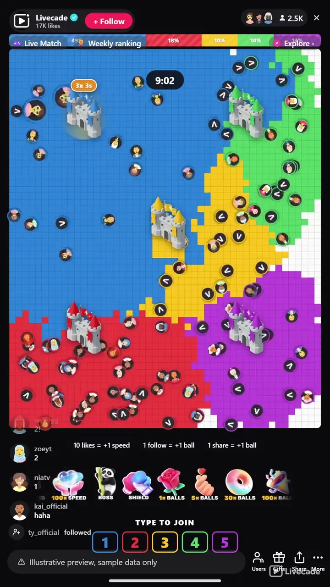

# Territory War - Interactive TikTok Live Game

> Type a number, get a ball with your face on it, and paint the map for your team.

Viewers type a number to pick a castle, and every viewer who joins gets a ball with their own face on it. Those balls paint the map as they travel, so a team only grows where its viewers actually are. Biggest empire when the clock runs out takes the round.

**[Play Territory War on Livecade](https://livecade.io/games/territory-war/?utm_source=github&utm_medium=readme&utm_campaign=territory-war)** - runs as a single browser source in OBS, Streamlabs, or TikTok LIVE Studio. Nothing for viewers to install.

## How viewers play

Viewers take part with the actions TikTok already gives them: **comments**, **gifts**, **likes**, **follows**, **shares**. Every action below is rebindable, so you decide which interaction drives which effect.

| Action | What it does |
| --- | --- |
| **+1 / +5 / +30 / +100 Balls** | Adds that many balls, each carrying the face of whoever sent it |
| **Speed Up** | Makes the balls that viewer already owns travel faster, so they pull away from the pack |
| **Boss** | Spawns one big slow ball that takes a wide bite of ground at every wall, and surges the whole team for 30 seconds |
| **Shield** | Freezes the borders so that team cannot lose ground for 15 seconds |
| **Likes** | Every ten likes buys the sender a speed step |
| **Follow / Share** | Each pays out one more ball for the team that viewer joined |

## How it works

### Type a number to join

Every viewer picks a castle by typing its number in chat, and gets a ball carrying their profile picture. Switching teams later carries the balls they earned across with them.

### Balls paint the ground they cross

Territory grows only where a ball actually travels. A ball stays inside its own colour, claims the cell it reaches at the frontier, and bounces back in, so each team stays one solid mass with a ragged edge.

### Gifts buy balls and speed

Gifts add more balls, or make the balls a viewer already owns travel faster, so spending is visible on screen. A boss is one big slow unit that bites a wide chunk of ground, and a shield makes your land untakeable for fifteen seconds.

## About the game

Territory War turns your chat into five armies fighting over one map. Typing a number is enough to join, and joining puts a ball on the field carrying your profile picture, so a viewer can point at the screen and say that one is me.

### Territory only grows where viewers are

Those balls are the entire game: ground is claimed only where a ball physically travels, so there is no growth rate ticking up in the background and no way to win without viewers on your side. A ball is trapped inside its own colour, and when it reaches the frontier it claims that cell and bounces back inward, which is what keeps each team a solid mass with a ragged, shifting edge instead of confetti.

### Spending is visible on screen

Gifts buy more balls or more speed, and a viewer who spends watches their own ball pull away from the pack, because speed is per-viewer rather than a team-wide buff nobody can see. The two expensive gifts swing a round instead of nudging it: a boss spawns one big slow unit that takes a mouthful of ground every time it reaches a wall, and a shield makes your territory untakeable for fifteen seconds, which is the one way to hold a collapsing front.

### Nobody is ever knocked out

Castles can never be captured, so a team squeezed back to its keep is always one gift away from being back in the fight. Rounds end on a timer or the moment someone dominates the map, then restart with the rosters cleared so everyone types their number again. Ten teams, twelve languages, and every colour, name and castle image is yours to set.

## What it looks like on stream

[Watch Territory War gameplay](https://cdn.livecade.io/games/territory-war.mp4)

## What you can configure

- **Interface language** - Twelve languages for the on-screen chrome
- **Teams** - Two to ten teams, each with its own name, colour and castle image
- **How a round ends** - A timer, or domination the moment a team passes your target share
- **Match length** - One to ten minutes when the round runs on a timer
- **Map detail** - Chunky, standard or fine, trading readability at phone size for tidiness
- **Balls a viewer gets for joining** - How much ground a new viewer starts painting with
- **Ball speed and speed soft limit** - How fast balls travel, and how far gifts can push that before returns diminish
- **Starting territory radius** - How much land each castle owns before anyone joins
- **Display** - Grid lines, the territory bar and the session win tally

## Languages

English, Spanish, Portuguese, French, German, Italian, Indonesian, Arabic, Turkish, Russian, Hindi, Romanian

## FAQ

<strong>How do viewers join Territory War?</strong>

They type a team number in chat, nothing else. That puts a ball with their profile picture on the map, and it starts painting ground for that team straight away. Viewers can switch teams later and keep the balls they earned.

<strong>How does a team actually grow?</strong>

Only where its balls travel. There is no growth rate running in the background, so a team with more viewers and more gifts covers more ground simply because it has more balls moving. That also means it self-regulates: balls bunch up and re-cross land the team already owns.

<strong>What do gifts do?</strong>

Gifts add balls or buy speed, and both are visible on screen because speed is per-viewer rather than a team-wide buff. The two priciest gifts swing a round: a boss spawns a big unit that eats a wide chunk of ground, and a shield freezes your borders for fifteen seconds.

<strong>Can a team be knocked out?</strong>

Castles can never be captured, so a team pushed back to its keep is still alive and one gift away from painting again. A round ends on the timer, or the moment one team dominates the map.

<strong>How do I add Territory War to my TikTok Live?</strong>

Add one browser source URL to OBS or your streaming software and go live. There is no plugin to install and nothing for your viewers to download.

## Setup

1. [Create a Livecade account](https://app.livecade.io/register?utm_source=github&utm_medium=cta&utm_campaign=territory-war)
2. Copy your overlay browser source URL
3. Paste it into OBS, Streamlabs, or TikTok LIVE Studio
4. Pick Territory War, set your triggers, and go live

Runs in the browser, so it works on Windows and macOS with nothing to download. [See all TikTok Live games](https://livecade.io/tiktok-live-games/?utm_source=github&utm_medium=readme&utm_campaign=territory-war).

---

_This repository documents Territory War, a hosted interactive game by [Livecade](https://livecade.io/?utm_source=github&utm_medium=footer&utm_campaign=territory-war). The game runs on Livecade's platform, so there is no source to install here._
